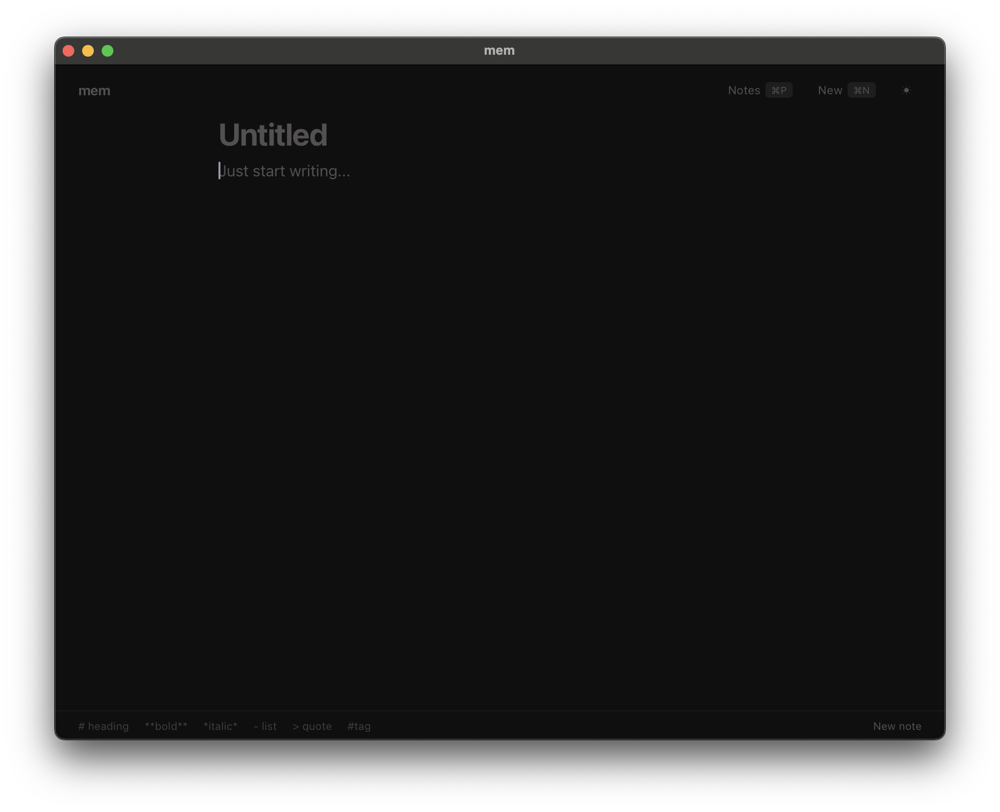
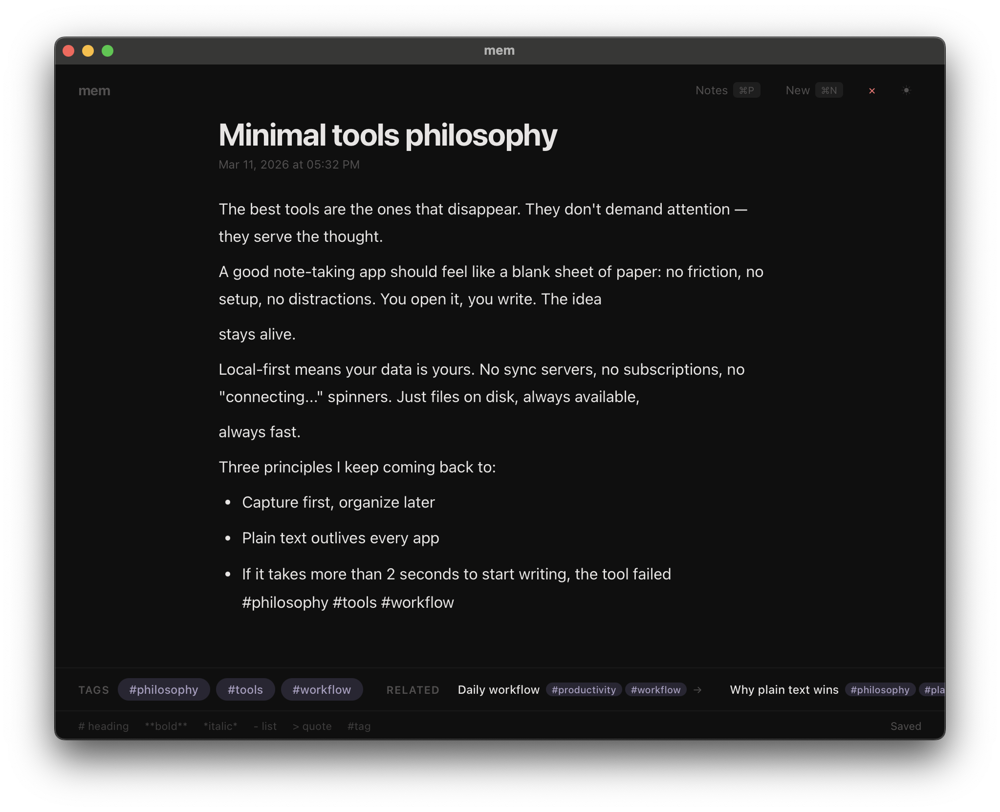
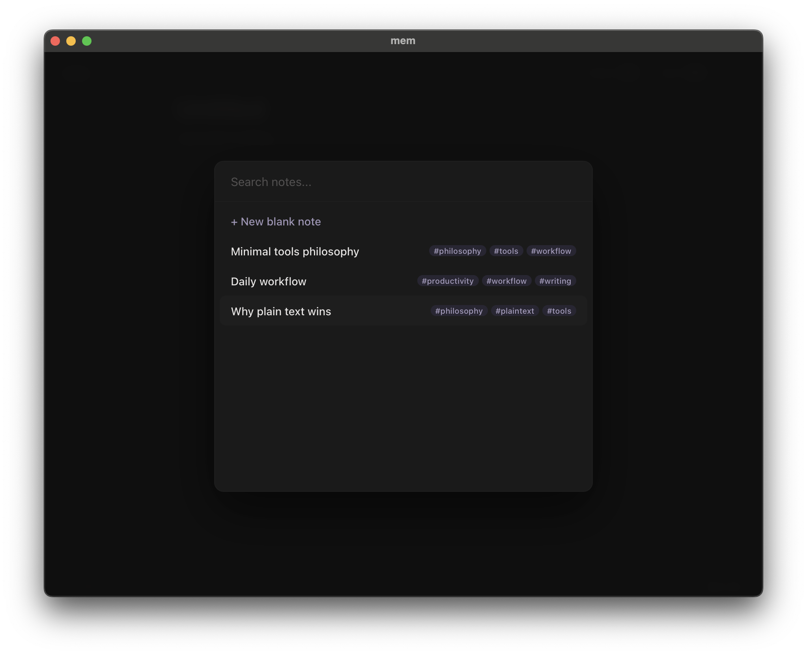
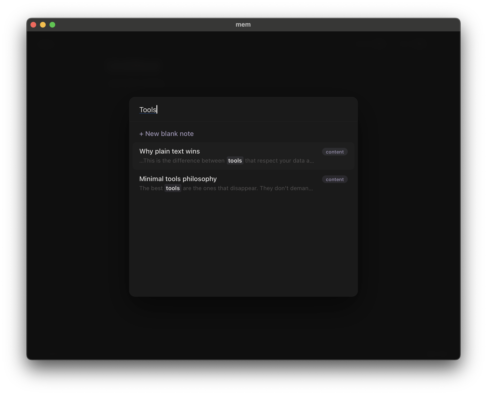

# mem

Minimal local-first knowledge keeper. Markdown files, SQLite index, tiny desktop UI, CLI.

<p align="center">
  
</p>

<p align="center">
  
</p>

<p align="center">
  
  
</p>

## Install

### Desktop app

Download the latest release for your platform:

| Platform | Download |
|----------|----------|
| macOS (Apple Silicon) | [.dmg](https://github.com/denyzhirkov/mem/releases/latest) |
| macOS (Intel) | [.dmg](https://github.com/denyzhirkov/mem/releases/latest) |
| Linux | [.AppImage](https://github.com/denyzhirkov/mem/releases/latest) / [.deb](https://github.com/denyzhirkov/mem/releases/latest) |
| Windows | [.msi](https://github.com/denyzhirkov/mem/releases/latest) |

### One-line install (CLI + Desktop)

```bash
curl -fsSL https://raw.githubusercontent.com/denyzhirkov/mem/master/scripts/install.sh | sh
```

Use `--cli-only` or `--app-only` to install just one component.

Or build from source:

```bash
cargo install --path crates/mem-cli
```

## Usage

### Desktop

Open the app and start writing. That's it.

- **Cmd+S** — save note
- **Cmd+N** — new blank note
- **Cmd+P** — search / switch notes
- **#tag** — type tags inline, they auto-extract on save

Notes are Markdown files in `~/.mem-vault/notes/`. Tags create connections — related notes appear at the bottom.

Auto-save kicks in after you stop typing or every ~80 characters.

### CLI

```bash
mem init                             # create a vault in current directory
mem note new "My idea"               # create a note
mem note new "Idea" -b "body text"   # create with body (or --stdin)
mem note list                        # list all notes
mem note list --tag rust             # filter by tag
mem note show <id-or-slug>           # print note content
mem note update <id> --title "New"   # rename (file gets renamed too)
mem note delete <id-or-slug>         # delete a note
mem note related <id-or-slug>        # notes sharing tags
mem search "query"                   # search notes
mem tags list                        # all tags with counts
mem sync status                      # git status
mem sync commit "update notes"       # git commit
mem sync pull                        # git pull
mem sync push                        # git push
```

### MCP (AI assistants)

`mem-mcp` exposes your vault to MCP clients (Claude Desktop, Claude Code,
Cursor, etc.) over stdio — agents can create, search, update, and sync notes
as structured tool calls.

```json
{
  "mcpServers": {
    "mem": {
      "type": "stdio",
      "command": "mem-mcp"
    }
  }
}
```

By default the server uses the global vault at `~/.mem-vault`. Set
`MEM_VAULT` in `env` only if your vault lives elsewhere:

```json
"env": { "MEM_VAULT": "/absolute/path/to/vault" }
```

See [docs/mcp.md](docs/mcp.md) for the full tool list and configuration.

## How it works

- **Files are truth** — notes live as `.md` files on disk. You can edit them with any editor.
- **SQLite is an index** — fast search, tags, backlinks. Delete it and it rebuilds from files.
- **Git sync** — your vault is just a folder. Push to a repo to sync between machines.
- **Tags** — write `#tag` anywhere in a note. Tags connect notes automatically.
- **Local-first** — no accounts, no cloud, no telemetry. Everything stays on your machine.

## Vault structure

```
~/.mem-vault/
  mem.json              # vault config
  notes/
    2026/
      2026-03-11-my-note.md
    inbox/
    journal/
  .mem/
    index.sqlite        # rebuildable index
```

## Development

```bash
# CLI
cargo run -p mem-cli -- note list

# Desktop
cd apps/desktop
npm install
npx tauri dev

# Build all (CLI + Desktop)
./scripts/build.sh 0.1.0
```

### Stack

- **Core**: Rust workspace (`mem-domain`, `mem-storage`, `mem-index`, `mem-parser`, `mem-sync`, `mem-core`)
- **Interfaces**: `mem-cli` (terminal), `mem-mcp` (MCP server), `mem-desktop` (Tauri + SolidJS + Tiptap)
- **Search**: SQLite FTS5
- **Sync**: Git CLI wrapper

## Auto-updates

Desktop app checks for updates on GitHub Releases. To enable:

1. Generate signing keys: `npx tauri signer generate -w ~/.tauri/mem.key`
2. Set `TAURI_SIGNING_PRIVATE_KEY` in GitHub repo secrets
3. Add the public key to `tauri.conf.json` → `plugins.updater.pubkey`
4. Update the `endpoints` URL with your GitHub username

## Release

Tag and push:

```bash
git tag v0.1.0
git push origin v0.1.0
```

GitHub Actions builds for macOS (ARM + Intel), Linux, and Windows, then creates a release.

## License

MIT
